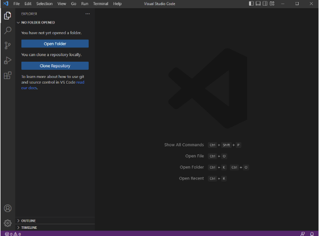

# Week 1 Lab Report
---
# How to Setup Remote Access
## *1. Look Up Your CSE15L Account*
Use this website here to look up your CSE15L account: https://sdacs.ucsd.edu/~icc/index.php

Use this link here to access the Google Doc with detailed instrunctions on how to look up and set your password for your CSE15L account: https://docs.google.com/document/d/1hs7CyQeh-MdUfM9uv99i8tqfneos6Y8bDU0uhn1wqho/edit

Move on to the next step of the lab if waiting for password to reset.

## *2. Setting Up Visual Studio Code*
`For Lab Computers`Visual Studio Code is already installed on the computers in the computer lab, so you can skip the insatllation process if you choose to use the computers in the computer lab. All work during this quarter can be worked on using those computers, so no need to set up on your personal computers. 

`Installing Visual Studio Code on Your Laptop` Go to the visual studio code website here and follow the instructions to install it for your laptop's operating system:  https://code.visualstudio.com/

After installing, open it up and choose your theme. Once you do that, your Visual Studio Code should application should look like the image below.

## *3. How to Connect Remotely*
`For Window Personal Devices Only` * *DO NOT do this for the computers in the computer lab because Git is already installed. Mac users don't need to do this as well.* *

Install Git for Windows using this link: https://gitforwindows.org/  
