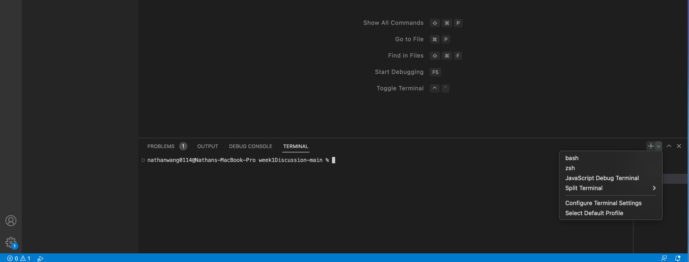

# Week 1 Lab Report
---
# How to Setup Remote Access
## *1. Look Up Your CSE15L Account*
Use this website here to look up your CSE15L account: https://sdacs.ucsd.edu/~icc/index.php

Use this link here to access the Google Doc with detailed instrunctions on how to look up and set your password for your CSE15L account: https://docs.google.com/document/d/1hs7CyQeh-MdUfM9uv99i8tqfneos6Y8bDU0uhn1wqho/edit

Move on to the next step of the lab if waiting for password to reset.

## *2. Setting Up Visual Studio Code*
`For Lab Computers`Visual Studio Code is already installed on the computers in the computer lab, so you can skip the insatllation process if you choose to use the computers in the computer lab. All work during this quarter can be worked on using those computers, so no need to set up on your personal computers. 

`Installing Visual Studio Code on Your Laptop` Go to the visual studio code website here and follow the instructions to install it for your laptop's operating system:  https://code.visualstudio.com/

After installing, open it up and choose your theme. Once you do that, your Visual Studio Code should application should look like the image below.


## *3. How to Connect Remotely*
`For Window Personal Devices Only` * *DO NOT do this for the computers in the computer lab because Git is already installed. Mac users don't need to do this as well.* *

Install Git for Windows using this link: https://gitforwindows.org/  

After installing Git, it is time to setup bash in the terminal.

`Bash Setup for Windows` Use this link here to set your terminal in Visual Studio Code to git bash: [Using Bash on VSCode for Windows](https://stackoverflow.com/questions/42606837/how-do-i-use-bash-on-windows-from-the-visual-studio-code-integrated-terminal/50527994#50527994)

`Bash Setup for MacOS` 
1. Open up the terminal in Visual Studios Code by either 
* going up to your menu bar while having VS Code open and pressing terminal, then new terminal.
* using the keyboard shortcut for toggling the terminal which can be found in the image below.
2. In the terminal at the bottom right next to the '+' sign, there is a down arrow. Press that to open up the drop down menu and select bash as your terminal. The image below shows this.



After opening the git bash terminal, type the command below in the terminal to use ssh.

`ssh cs15lwi23zzz@ieng6.ucsd.edu` * *'zzz' should be replaced by the 3 letters that are unique for each CSE15L student and in the terminal you enter the command after the "$" sign* *

If this step is done correctly, you should see a message like this in your terminal since this is likely your first time connecting to the server.

`⤇ ssh cs15lwi23zzz@ieng6.ucsd.edu
The authenticity of host 'ieng6.ucsd.edu (128.54.70.227)' can't be established.
RSA key fingerprint is SHA256:ksruYwhnYH+sySHnHAtLUHngrPEyZTDl/1x99wUQcec.
Are you sure you want to continue connecting (yes/no/[fingerprint])?`

Type 'yes' in the terminal and press enter.

If that is done correctly, the terminal should prompt you to type in your password. Do so and press enter after. * *While typing in your password, you won't see any characters in the terminal, but trust me they are there! This is just a security measure.* *

If everything went smoothly, you should see this in your terminal.

```
# Now on remote server
Last login: Sun Jan  2 14:03:05 2022 from 107-217-10-235.lightspeed.sndgca.sbcglobal.net
quota: No filesystem specified.
Hello cs15lwi23zz, you are currently logged into ieng6-203.ucsd.edu

You are using 0% CPU on this system

Cluster Status 
Hostname     Time    #Users  Load  Averages  
ieng6-201   23:25:01   0  0.08,  0.17,  0.11
ieng6-202   23:25:01   1  0.09,  0.15,  0.11
ieng6-203   23:25:01   1  0.08,  0.15,  0.11

Sun Jan 02, 2022 11:28pm - Prepping cs15lwi23
```
Good Job! You have successfully connected remotely from the terminal on your computer to a computer in the CSE basement. This means that any commands you do on your terminal(the client) will run on that computer(the server).

## *4. Try Out Some Commands in the Terminal*
Some common commands you should get familiar with are 'cd', 'ls', 'pwd', 'mkdir', and 'cp'. Run these commands a couple times both on the bash terminal and your own computer's terminal to see what each command does. Discuss in your group and figure out what each command does.

Some specific useful commands to try out:
* cd ~
* cd
* ls -lat
* ls -a
* ls<directory> * *<directory> is replaced with '/home/linux/ieng6/cs15lwi23/cs15lwi23zzz', where 'zzz' is a group member's unique 3 letters for their CSE15L account.* *
* cp /home/linux/ieng6/cs15lwi23/public/hello.txt ~/
* cat /home/linux/ieng6/cs15lwi23/public/hello.txt

