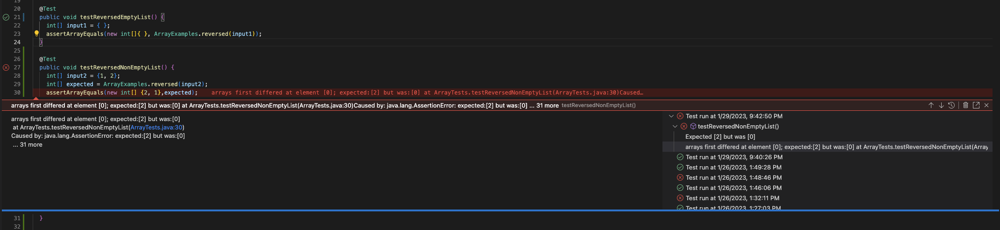

# Week 2 Lab Report
---
## Part 1: Writing a Web Server Called String Server
**Code for StringerServer**
```
import java.io.IOException;
import java.net.URI;
/add
class Handler implements URLHandler {
    String word = "";

    public String handleRequest(URI url) {
        if (url.getPath().equals("/add-message")) {
            String[] parameters = url.getQuery().split("=");
            if (parameters[0].equals("s")) {
                if(word.equals("")) {
                    word += parameters[1];
                }
                else {
                    word = word + "\n" + parameters[1];
                }
                return word;
            }
        }
        return "404 Not Found!";
    }
}

class StringServer {
    public static void main(String[] args) throws IOException {
        if(args.length == 0){
            System.out.println("Missing port number! Try any number between 1024 to 49151");
            return;
        }

        int port = Integer.parseInt(args[0]);

        Server.start(port, new Handler());
    }
}
```
**Screenshots of `/add-message` Being Used**

Calling request `/add-message?s=Hello, how are you?` to StringServer

The methods being called are HandleRequest in class Handler and the main method in class String Server. 
The relevant argument to the HandleRequest method is the parameter url, which is a URI. The relevant argument to the main method is the command line argument, which only takes the port part of the url. Everytime we enter a new url, the parameter that holds a URI changes in HandlerRequest. The value of String word also could change if `/add-message` is requestd in the url. For the call in the screenshot, word starts off as an emtpy string, then the String `Hello, how are you?` is concatenated to word. The host number will remain the same as long as I am using the same server. 


Calling request `/add-message?s=I am doing great!` to StringServer

The methods being called are HandleRequest in class Handler and the main method in class String Server. 
The relevant argument to the HandleRequest method is the parameter url, which is a URI. The relevant argument to the main method is the command line argument, which only takes the port part of the url. Everytime we enter a new url, the parameter that holds a URI changes in HandlerRequest. The value of String word also could change if `/add-message` is requestd in the url. For the call in the screenshot, word starts off as `Hello, how are you?`, then a line is skipped and the String `I am doing great!` is concatenated to word. The host number will remain the same as long as I am using the same server. 


## Part 2: Choosing One of The Bugs in Lab 3

**Method: Reversed**

Failure Inducing Input:
```
@Test
  public void testReversedNonEmptyList() {
    int[] input2 = {1, 2};
    int[] expected = ArrayExamples.reversed(input2);
    assertArrayEquals(new int[] {2, 1},expected);
  }
```

Input That Doesn't Induce a Failure:
```
@Test
  public void testReversedEmptyList() {
    int[] input1 = { };
    assertArrayEquals(new int[]{ }, ArrayExamples.reversed(input1));
  }
```

Symptom: 



Bug:

*Before Code*
```
static int[] reversed(int[] arr) {
  int[] newArray = new int[arr.length];
  for(int i = 0; i < arr.length; i += 1) {
    arr[i] = newArray[arr.length - i - 1];
  }
  return arr;
}
```
*After Code*
```
static int[] reversed(int[] arr) {
  int[] newArray = new int[arr.length];
  for(int i = 0; i < arr.length; i += 1) {
    newArray[i] = arr[arr.length - i - 1];
  }
  return newArray;
}
```

The fix addresses the bug in the original code because originally the code was taking elements from the newly created array into our original array and returning the original array which is now made up of the elements in the new array but reversed. The new array is supposed to be the one taking in elements from the orginal array in reverse order, not the other way around. When taking in elements from the new array to the original array, the original array will become all 0's because the new array is instantiated using the length of the original array. This means that all the elements in the new array is the default value, which is 0. In order to fix this, I set it so that the new array is taking in elements from the original array in reverse order, and return the new array instead of the original array.

## Part 3: Something New That I Learned

Something I learned in lab during week 2 that I didn't know before was how to host a local server off my own computer. Through that lab I was able to learn how to code a URL Handler that took in diffrent requests and how to use those paths to run certain things on a server. I also learned what files I needed to actually start up the server and how to get the host from a command line argument. Lastly, I learned the commands to compile and run by server to boot it up on to the internet.
