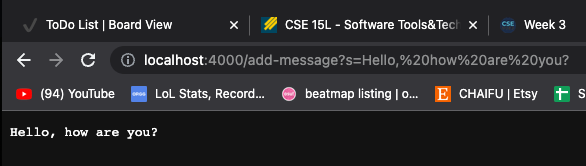
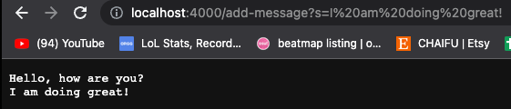

# Week 2 Lab Report
---
## Part 1: Writing a Web Server Called String Server
**Code for StringerServer**
```
import java.io.IOException;
import java.net.URI;
/add
class Handler implements URLHandler {
    String word = "";

    public String handleRequest(URI url) {
        if (url.getPath().equals("/add-message")) {
            String[] parameters = url.getQuery().split("=");
            if (parameters[0].equals("s")) {
                if(word.equals("")) {
                    word += parameters[1];
                }
                else {
                    word = word + "\n" + parameters[1];
                }
                return word;
            }
        }
        return "404 Not Found!";
    }
}

class StringServer {
    public static void main(String[] args) throws IOException {
        if(args.length == 0){
            System.out.println("Missing port number! Try any number between 1024 to 49151");
            return;
        }

        int port = Integer.parseInt(args[0]);

        Server.start(port, new Handler());
    }
}
```
**Screenshots of `/add-message` Being Used**

Calling request `/add-message?s=Hello, how are you?` to StringServer

The methods being called are HandleRequest in class Handler and the main method in class String Server. 
The relevant argument to the HandleRequest method is the parameter url, which is a URI. The relevant argument to the main method is the command line argument, which only takes the port part of the url. Everytime we enter a new url, the parameter that holds a URI changes in HandlerRequest. The value of String word also could change if `/add-message` is requestd in the url. For the call in the screenshot, word starts off as an emtpy string, then the String `Hello, how are you?` is concatenated to word. The host number will remain the same as long as I am using the same server. 




Calling request `/add-message?s=I am doing great!` to StringServer

The methods being called are HandleRequest in class Handler and the main method in class String Server. 
The relevant argument to the HandleRequest method is the parameter url, which is a URI. The relevant argument to the main method is the command line argument, which only takes the port part of the url. Everytime we enter a new url, the parameter that holds a URI changes in HandlerRequest. The value of String word also could change if `/add-message` is requestd in the url. For the call in the screenshot, word starts off as `Hello, how are you?`, then a line is skipped and the String `I am doing great!` is concatenated to word. The host number will remain the same as long as I am using the same server. 



## Part 2: Choosing One of The Bugs in Lab 3
