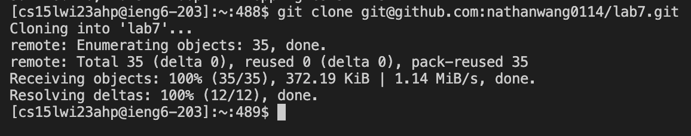
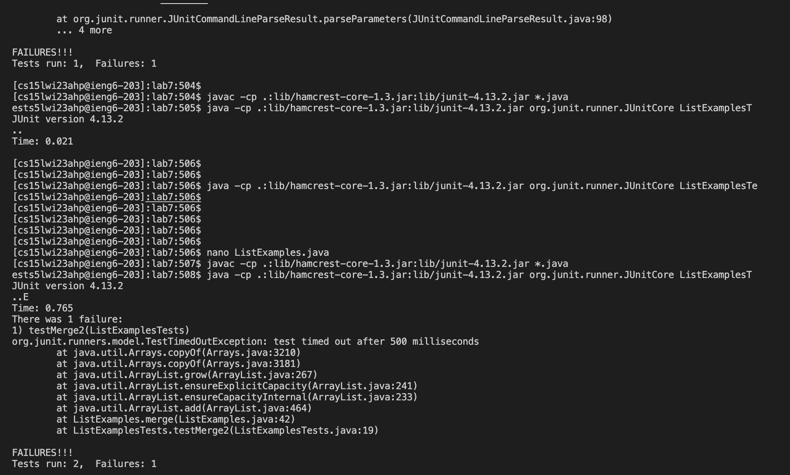
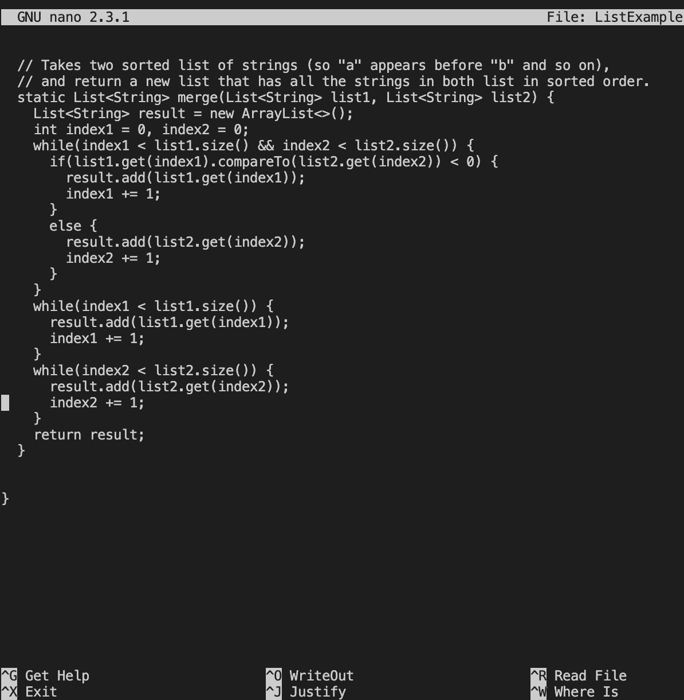
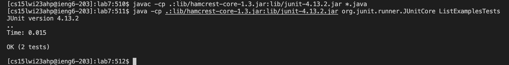
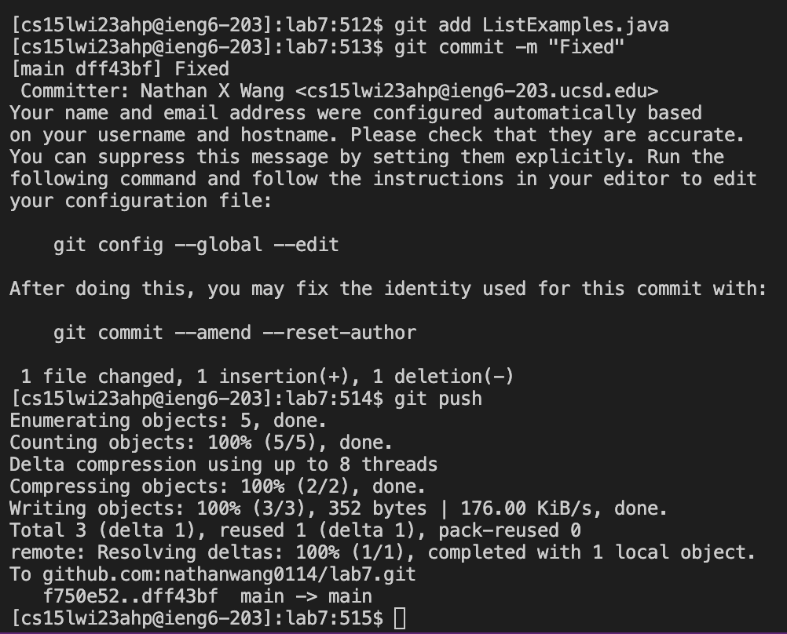

# Lab Report 4

## Reproducing the Task From Lab This Week (Steps 4 - 9)

**Step 4: Log into ieng6**

*Keys Pressed:* `<ctrl-v><left><left><left><left><left><left><left><left><left><left><left><left><left><left><left><backspace><backspace>ahp<enter>`

I used `<ctrl-v>` to paste in the login info from week 1 lab. Then, I used the left arrow key 15 times to get to the @ part of username, and deleted the two filler 'z' characters. After that, I typed 'a' 'h' and 'p' since those are the letters corresponding to my course specific username. Finally, I pressed enter to login.

**Step 5: Clone your fork of the repository from your Github account**

*Keys Pressed:* `git<space>clone<space><ctrl-v><enter>`

I first typed in git clone which is the cloning command. Then, I used `<ctrl-v>` to paste in the ssh clone link of my lab7 forked repository from github. Finally, I pressed enter to clone the repository onto ieng6.

**Step 6: Run the tests, demonstrating that they fail**

*Keys Pressed:* `cd<space>lab7<enter>, <ctrl-v><enter>, <ctrl-v>ListExamplesTests<enter>`

I first cd'ed into the repository I cloned by typing 'cd lab7'. Then in order to run the Junit tests, I went to the week 3 lab to copy and paste the mac Junit commands. I copied the compile line and pasted it into the terminal using `<ctrl-v>` and pressing enter. Then, I have to run the test so I copied the Junit run line from week 3's lab up to the part right before ArrayTests, since I am going to be running a different tester file. I paste the line I just copied into the terminal using `<ctrl-v>` and typing in the tester file's name, 'ListExamplesTests', after it. Lastly, I press enter to run the Junit test and it shows that one test failed.

**Step 7: Edit the code file to fix the failing test**

*Keys Pressed:* `nano<space>ListExamples.java<enter>, <down><down><down><down><down><down><down><down><down><down><down><down><down><down><down><down><down><down><down><down><down><down><down><down><down><down><down><down><down><down><down><down><down><down><down><down><down><down><down><down><down><down><right><right><right><right><right><right><right><right><right><right><right><right><backspace>2<ctrl-o><enter><ctrl-x>`

In order to edit the code through the terminal, I have to use the nano code editor on the terminal by typing nano 'ListExamples.Java', which is the name of the file. Then, I downed arrow 42 times to get to the 43rd line where the bug is. From there, I right arrowed 12 times to get to the spot right after where the bug is. I backspace and enter 2 to fix the bug which was incrementing index1 instead index 2. Then, in order to save my changes I pressed `<ctrl-o>` and entered to save. Lastly, in order to exit out of nano I pressed `<ctrl-x>`.

**Step 8: Run the tests, demonstrating that they now succeed**

*Keys Pressed:* `<up><up><up><enter>, <up><up><up><enter>`

To run the Junit tests again, I have to compile the tests and run them. These are the same commands I used previously in the terminal to run them the first time, so I up arrowed 3 times to get back to the Junit compline line. Pressing enter I compile the Junit tests. Lastly, I went back to the Junit run line which is now 3 arrows up, so I up arrowed 3 times and press entered to run the tests. Now, we can see that the tests have passed meaning we fixed the bug.

**Step 9: Commit and push the resulting change to your Github account**

*Keys Pressed:* `git<space>add<space>ListExamples.java<enter>, git<space>commit<space>-m<space>"Fixed"<enter>, git<space>push<enter>`

I first added the file I wanted to commit to my GitHub account by typing 'git add ListExamples.java' and pressing enter. 'git add' is the terminal command used to add files you want to commit to GitHub and the editted file's name is 'ListExamples.java'. Then, in order to commit the file I typed the command 'git commit -m "Fixed"' and pressed enter. 'git commit is the terminal command used to commit a file to GitHub and '-m' is used to specify that you are specifying the commit message through the terminal. The commit messagge I chose was 'Fixed', so you can see that I typed "Fixed" after '-m'. Lastly, in order to push it onto my GitHub account I have to type git push and enter.
