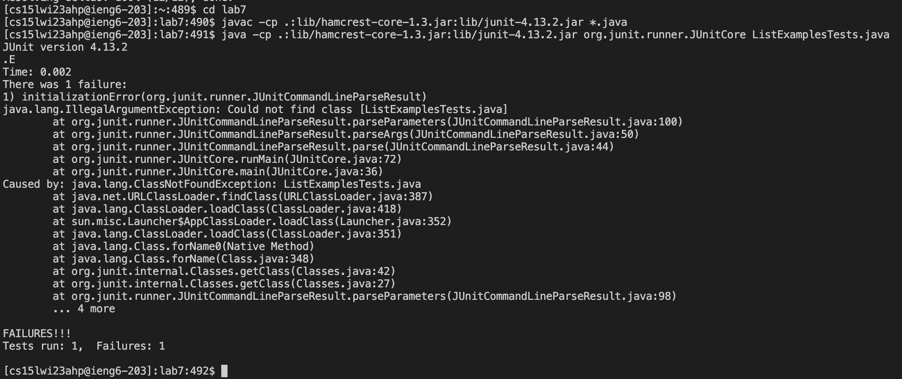

# Lab Report 4

## Reproducing the Task From Lab This Week (Steps 4 - 9)

**Step 4: Log into ieng6**

*Keys Pressed:* `<ctrl-v><left><left><left><left><left><left><left><left><left><left><left><left><left><left><left><backspace><backspace>ahp<enter>`

I used `<ctrl-v>` to paste in the login info from week 1 lab. Then, I used the left arrow key 15 times to get to the @ part of username, and deleted the two filler 'z' characters. After that, I typed 'a' 'h' and 'p' since those are the letters corresponding to my course specific username. Finally, I pressed enter to login.

**Step 5: Clone your fork of the repository from your Github account**

*Keys Pressed:* `git<space>clone<space><ctrl-v>`

I first typed in git clone which is the cloning command. Then, I used `<ctrl-v>` to paste in the ssh clone link of my lab7 forked repository from github. Finally, I pressed enter to clone the repository onto ieng6.

**Step 6: Run the tests, demonstrating that they fail**

*Keys Pressed:* `cd<space>lab7, <ctrl-v>, <ctrl-v>ListExamplesTests`

I first cd'ed into the repository I cloned by typing 'cd lab7'. Then in order to run the Junit tests, I went to the week 3 lab to copy and paste the mac Junit commands. I copied the compile line and pasted it into the terminal using `<ctrl-v>` and pressing enter. Then, I have to run the test so I copied the Junit run line from week 3's lab up to the part right before ArrayTests, since I am going to be running a different tester file. I paste the line I just copied into the terminal using `<ctrl-v>` and typing in the tester file's name, 'ListExamplesTests', after it. Lastly, I press enter to run the Junit test and it shows that one test failed.
